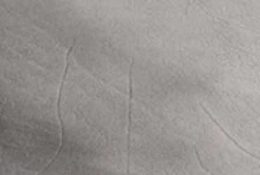
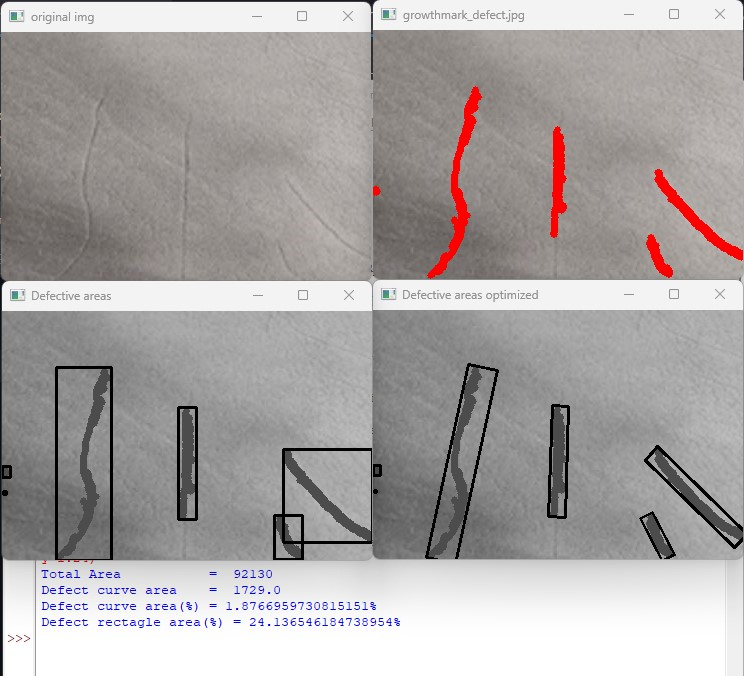

# Computer Vision-Based Leather Inspector

This is an OpenCV based leather inspector to detect defective areas in leather

This Python Program works on the below steps.

1. Grey Scaling the Input Image
2. Thresholding the Grey scaled Image
3. Finding the contours(Defect marks)
4. Drawing two sets of rectangles for the contours
5. one set of normal rectangles covering the defect marks
6. and the second with a min rectangle area

Below is an example of a growth mark defect 

After running the Python Script The Output will be as below

